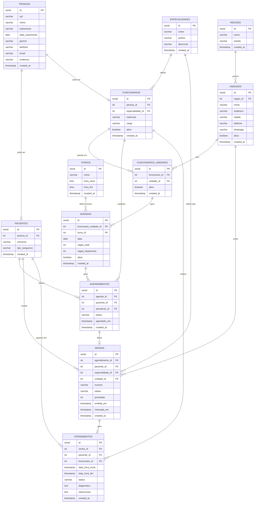

# Atende 🎫

Sistema de agendamento e gerenciamento de atendimento hospitalar. O paciente entra em contato pelo telefone ou WhatsApp, a atendente realiza o cadastro e define o agendamento. Ao chegar na unidade, o paciente pega a senha da sua especialidade e aguarda ser chamado.

---

## Tecnologias

- [PostgreSQL](https://www.postgresql.org/)
- [SQL](https://www.postgresql.org/docs/current/sql.html)
- [Mermaid](https://mermaid.js.org/)

---

## Funcionalidades

- Cadastro de regiões e unidades de saúde com telefone e WhatsApp
- Cadastro de funcionários com especialidade médica vinculada ao profissional
- Vínculo de funcionários a múltiplas unidades
- Agendamento realizado pela atendente via telefone ou WhatsApp
- Controle de vagas por agenda — cada médico tem limite de pacientes por turno
- Emissão de senha por especialidade (ex: A001 - Cardiologia, B001 - Pediatria)
- Verificação de agendamento ativo ao chegar na unidade
- Suporte a senhas prioritárias
- Registro completo de atendimentos com diagnóstico e observações
- Histórico de atendimentos preservado por paciente
- Funcionário pode ser paciente ao realizar um agendamento

---

## Fluxo do sistema

```
Paciente acessa o site ou redes sociais
        ↓
Encontra o telefone ou WhatsApp da unidade
        ↓
Atendente cadastra o paciente
        ↓
Atendente define o agendamento
(médico, data, turno)
        ↓
No dia, paciente chega na unidade
        ↓
Informa CPF no balcão ou totem
        ↓
Sistema verifica agendamento ativo
        ↓
Senha emitida conforme especialidade do médico
(ex: A001 - Cardiologia)
        ↓
Paciente aguarda ser chamado
        ↓
Atendimento registrado e concluído
```

---

## Modelo de Dados



---

## Descrição das entidades

**Pessoas** — Cadastro central de todas as pessoas. Base para pacientes e funcionários.

**Pacientes** — Pessoas que buscam atendimento. Armazena convênio e tipo sanguíneo.

**Especialidades** — Define os tipos de atendimento e o prefixo da senha correspondente (ex: Cardiologia → A, Pediatria → B). Vinculada diretamente ao funcionário.

**Funcionários** — Médicos, atendentes e demais profissionais. A especialidade é uma característica do profissional, definida uma única vez no cadastro. Um funcionário pode ser paciente ao realizar um agendamento.

**Funcionários_Unidades** — Vínculo entre funcionários e unidades. Controla em quais unidades o profissional está ativo.

**Regiões** — Agrupamento geográfico de unidades por cidade e estado.

**Unidades** — Hospitais, clínicas e postos de saúde. Contém telefone e WhatsApp para contato inicial do paciente.

**Turnos** — Blocos de horário reutilizáveis (ex: Manhã 08:00–12:00, Tarde 13:00–17:00).

**Agendas** — Disponibilidade de um médico em uma unidade via `funcionario_unidade_id`, turno e data. Controla `vagas_total` e `vagas_disponiveis`. A especialidade é obtida automaticamente pelo vínculo do médico.

**Agendamentos** — Reserva criada pela atendente via telefone ou WhatsApp. Registra qual atendente realizou o agendamento.

**Senhas** — Emitidas ao chegar na unidade somente para pacientes com agendamento confirmado. O tipo da senha segue a especialidade do médico agendado.

**Atendimentos** — Registro completo de cada atendimento. Referencia senha, paciente e funcionário diretamente.

---

## Campos de status

### Agendamentos
| Status | Descrição |
|---|---|
| confirmado | Agendamento realizado com sucesso |
| cancelado | Agendamento cancelado |
| concluido | Atendimento realizado |
| nao_compareceu | Paciente não apareceu no dia |

### Senhas
| Status | Descrição |
|---|---|
| aguardando | Senha emitida, paciente na fila |
| chamada | Senha chamada, paciente se dirigindo ao atendimento |
| atendida | Atendimento concluído |
| cancelada | Paciente não compareceu ou desistiu |

### Atendimentos
| Status | Descrição |
|---|---|
| em_andamento | Atendimento iniciado |
| concluido | Atendimento finalizado com sucesso |
| cancelado | Atendimento cancelado |

---

## Regras de negócio

- Paciente entra em contato pelo telefone, WhatsApp da unidade ou Presencial
- Atendente cadastra o paciente e define o agendamento
- A especialidade é uma característica do funcionário, definida no seu cadastro
- Agendamento só é permitido se houver `vagas_disponiveis > 0` na agenda
- Ao agendar, `vagas_disponiveis` é decrementado automaticamente
- Ao cancelar agendamento, `vagas_disponiveis` é incrementado
- Senha só é emitida se o paciente tiver agendamento com status `confirmado`
- Paciente só é atendido na unidade onde foi agendado
- O tipo da senha segue a especialidade do médico agendado
- Um funcionário pode ser paciente ao realizar um agendamento
- O histórico do paciente é preservado mesmo após exclusão de senhas ou agendamentos


---

## Versão

| Versão | Descrição |
|---|---|
| 1.0.0 | Estrutura inicial — PESSOAS, CLIENTES, ATENDENTES, AGENDAMENTOS, TURNOS e AGENDAS com controle de vagas |
| 1.0.1 | CLIENTES renomeado para PACIENTES, ATENDENTES para FUNCIONARIOS |
| 1.0.2 | Adicionado REGIOES e WhatsApp em UNIDADES |
| 1.0.3 | FUNCIONARIOS_UNIDADES criado — médico pode atender em múltiplas unidades |
| 1.0.4 | ESPECIALIDADES criado como tabela própria com prefixo de senha |
| 1.0.5 | ESPECIALIDADES movida para vínculo direto com FUNCIONARIOS |
| 1.0.6 | AGENDAS passa a referenciar `funcionario_unidade_id` — elimina redundância |
| 1.0.7 | SENHAS recebe `unidade_id` direto — consultas por unidade simplificadas |

---

## Referências

- [Atividade prática — CafeGeek](https://cafegeek.eti.br/banco%20de%20dados/modelagem-de-banco-de-dados-com-postgresql-atividade-pratica-passo-a-passo/)
- [Mermaid Live Editor](https://mermaid.live/)
- [PostgreSQL Docs](https://www.postgresql.org/docs/)

---

## Licença

MIT License — fique à vontade pra usar e modificar.
